```{r setup, include=FALSE, message = FALSE}
options(scipen = 0, digits = 3)  # controls number of significant digits printed
library(tidyverse)
library(kableExtra)
```

\bigskip

The code to reproduce this report is available [on Github](https://github.com/anthonymansur/school-dropouts-data-mining).

\newpage

# Executive Summary

**Problem.** In 2019, there were about 2 million status dropouts, or people between the ages of 16 through 24 who are not enrolled in school and have not earned a high school credential. Although this number isn't alarming, and has been decreasing over the years, the rates aren't equal among U.S. counties. There are several reasons why students decide to drop out. These may include not feeling supported, challenged, or motivated; not being able to keep up with school work; having to take care of a single parent or younger siblings; just to name a few. 

In this report we take a look at the highschool dropout rates in 2007 of several U.S. counties, along with statistics on teacher compensation and level of education, and county-level data to see if we can find out what are the most important factors that impact whether or not a student may drop out.

[https://nces.ed.gov/fastfacts/display.asp?id=16]

**Data.** The dataset is pulled data from two sources. The first source comes from the National Center for Education Statistics (NCES). From the NCES, there was two datasets that were pulled, one containing the dropout rates for 2007 of over 18,000 Local Education Agencies (LEAs), or public authorities within a state that maintains administrative control of public schools. The other dataset is a teacher compensation survey from 2006-2007 from 17 participating states that includes the mean base salary segregated by level of experience and the percentage of teacehrs within each bracket of teaching experience. The second source is from the National Historical Geographic Information System (NHGIS) with a dataset from the 2009 American Community Survey. This dataset includes county-level statistics over a five year period (2005-2009) and includes both economic data (i.e., gini-index, per-capita income, percentage of pop. on welfare) as well as demographic data (i.e., percetanges of pop. with high school degree or higher, that are married, and that are single mothers). The statistics on the LEAs were averaged and mapped to the corresponding counties that are located in.

**Analysis.** This report contains several predictive models that attempt to see which are the best factors to use to predict the high school dropout rate of a county. The report includes six different cross-validated models: ordinary least squares, ridge regression, LASSO regression, elastic net regression, random forest, and boosting. Of the regression models, ordinary least squares had the least test error, while both random forest and boosting had approximately the same test error (and the lowest overall). All models had test errors lower than the intercept-only model.

**Conclusions.** Based on all the models that were analyzed, the two strongest predictors of a county's dropout rate are the domestic setting under which the student is in and the teachers they have. All models used the fact that counties with the higher percentages of single mothers tended to have higher school dropout rate while, on the contrary, those with a higher married population tended to have lower dropout rates. Furthermore, counties with more experienced teacher, not just necessarily those that were paid more, tended to have lower dropout rates. Although keeping the limitations of this analysis in mind, the data supports the claim that if a county wants to lower their dropout rates, it should focus on the quality of its teachers and further analyze how domestic affairs impact students and their ability to stay in school.

# Introduction

**Background.** TODO

**Analysis goals.** TODO

**Significance.** TODO

# Data

## Data sources
The first source of the data comes from the Common Core of Data (CCD) nonfiscal surveys submitted annualy to the national center for Education Statistics (NCES) by state education agencies (SEAs). The first dataset from this source contains the number of students who received a regular diploma or alternative credential, the Average Freshmen Graduation Rate (AFGR), the enrollment base for the AFGR, and the number of dropouts for LEAs from the NCES Common Core of Data LEA Universe. This dataset can be obtained via this link: https://nces.ed.gov/ccd/drpagency.asp

The second dataset from this source is a Teacher Compensation Survey taken at the LEA level. It includes data from 17 participating states in 2006-2007: Arizona, Arkansas, Colorado, Florida, Idaho, Iowa, Kansas, Kentucky, Louisiana, Maine, Minnesota, Mississippi, Missouri, Nebraska, Oklahoma, South Carolina, and Texas. The data items aggregated at the LEA level includes: the percentage distribution of teachers by education background and by teaching experience grouping, the mean number of years of teaching experience, the mean base salary, and the mean base salary by teaching experience groupings. For more information, see https://nces.ed.gov/ccd/tcssurv.asp 

The third dataset from this source is a geographical reference file that is used to map each LEA to a U.S. county. For more information, see https://nces.ed.gov/ccd/data_grf.asp 

The second source of the data comes from the NHGIS via their data extraction tool https://data2.nhgis.org/main. The dataset extracted is the 2009 American Community over the span of 5 years  (2005-2009). See https://www.census.gov/data/developers/data-sets/acs-5year/2009.html for more information. Only a select few variables were selected from this dataset, including economic and demographic factors at a county level. See below for more information.

## Data cleaning

To clean the data, the two county files were joined into a table by the unique identifier, and only the final selected variables of interest were extracted from this file, per county. Then, the variables were modified to be with respect to population percentage. For instance, the proportion of married households is equal to the number of married households divided by the total number of households recorded. 

After the county-level data was compiled into one table, the teacher compensation dataset was joined with the dropout dataset, with the LEA being the unique identifier. Only the dropout rate was extracted from the dropout dataset, while all the variables from the teacher compensation dataset were used. Note, the teacher compensation dataset had some missing values, so for complete analysis of an LEA, we dropped all the observations that had an incomplete variable. 

Once all the teacher compensation statistics and dropout rate were joined into a table at the LEA level, the LEA and County mapping table was used to map and aggregate each LEA statistics to the county that LEA belonged to. 

Finally, the county-level data was joined with the aggregated teacher and dropout dataset to get the final table. See below for the final variables that were used for analysis.

## Data description

### Observations

The dataset has a total of 1238 observations, corresponding to U.S. Counties

### Response Variable

Our response variable is the dropout rate of that county, measured by taking the mean of all the measured LEAs corresponding to that county.

### Features

We had a total of 17 features used for analysis.

- `married`: Number of married-couple family household over the total number of households
- `single_mom`: Number of Female family households with no husband present over the total number of households
- `gini_index`: the gini index of income inequality
- `per_capita_income`: the log of Per Capita income in the past 12 months (in 2009 Inflation-Adjusted Dollars)
- `welfare`: Number of households receiving public assitance over the total number of households
- `educated`: Number of people with a high school degree or higher over the total population 25 years and over.
- `advanced_educ`: Percentage of full-time teachers with a masters or doctorate degree
- `exp_1_5`: Percentage of full-time teachers with 1-5 years of teaching experience
- `exp_6_10`: Percentage of full-time teachers with 6-10 years of teaching experience
- `exp_11_20`: Percentage of full-time teachers with 11-20 years of teaching experience
- `exp_21_30`: Percentage of full-time teachers with 21-30 years of teaching experience
- `exp_gt_30`: Percentage of full-time teachers with over 30 years of teaching experience
- `mbsal_1_5`: Mean base salary of teachers with 1-5 years of teaching experience
- `mbsal_6_10`: Mean base salary of teachers with 6-10 years of teaching experience
- `mbsal_11_20`: Mean base salary of teachers with 11_20 years of teaching experience
- `mbsal_21_30`: Mean base salary of teachers with 21_30 years of teaching experience
- `mbsal_gt_30`: Mean base salary of teachers with over 30 years of teaching experience

## Data allocation
The data was randomly split into training and test groups, with 80% of the observations being used for training and the remaining 20% for testing. A set seed was used so that the results were reproducible. Note, any N/As were removed from the data prior.

## Data exploration

### Response
The response variable's distribution is shown in Figure \@ref(fig:response-boxplot). As seen in the box plot
We first sought to understand the response variable’s distribution. As seen in the boxplot of the dropout rate variable, the data appears right-skewed with several outliers to the far right. The median dropout rate is 2.9 percent. The sorted data (Table \@ref(tab:top-10-counties)) shows the counties in this dataset with the highest dropout rates. From the 17 states being analyzed, the top ten counties came from Lousiana, Colorado, and Minnesota.

```{r response-boxplot, out.width = "80%", fig.cap = "Distribution of dropout rate for the counties observed.", fig.align='center', echo = FALSE}
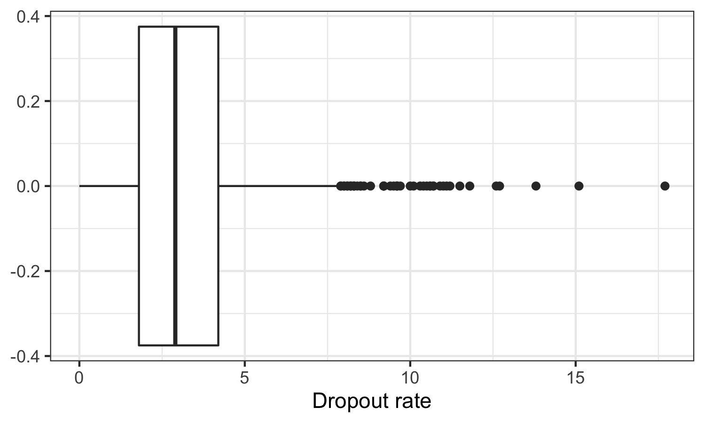
```

```{r top-10-counties, message = FALSE, echo = FALSE}
read_tsv("../results/top-10-counties.tsv") %>%
  kable(format = "latex", row.names = NA, 
        booktabs = TRUE, digits = 3, 
        col.names = c("County", "State", "Dropout rate"),
        caption = "Top ten counties by dropout rate 
        (expressed as a percentage).") %>%
  kable_styling(position = "center")
```


### Features
Histograms of each explanatory variable is shown in Figure \@ref(fig:feature-variation) 
```{r feature-variation, out.width = "100%", fig.cap = "Distribution of explanatory variables.", fig.align='center', echo = FALSE}
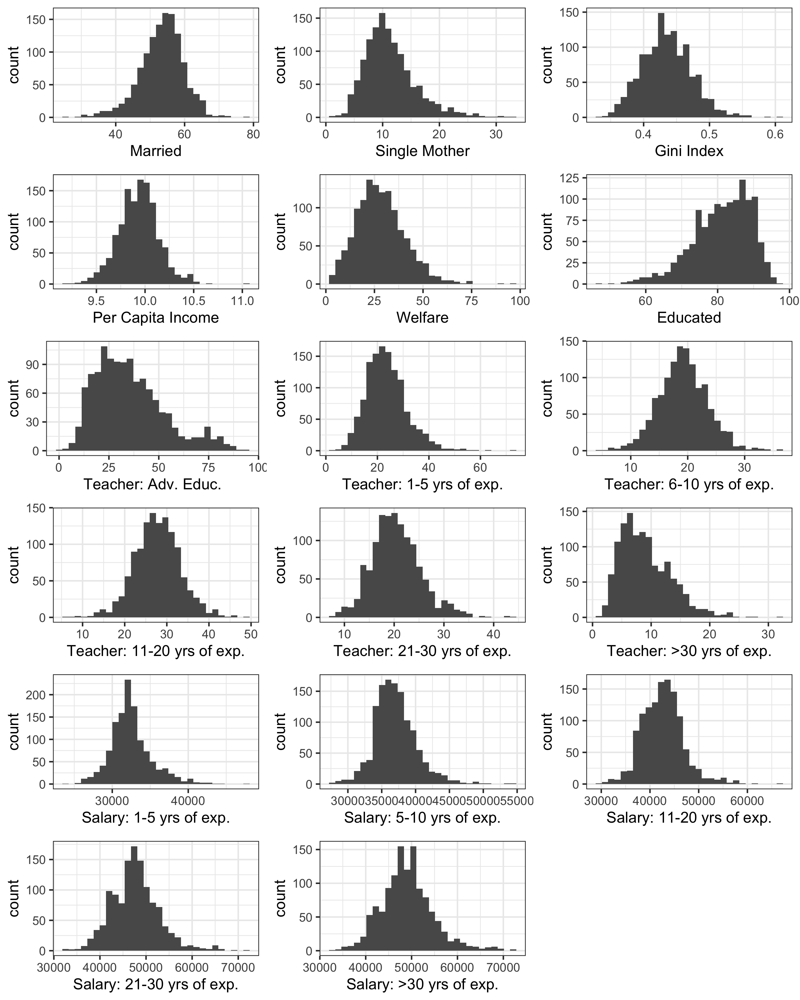
```

The correlation of the features are broken down into three correlation tables. Two for demographic and economic variables (see Figure \@ref(fig:category-correlation)), and one for the total correlations (see Figure \@ref(fig:total-correlation)). 

```{r category-correlation, out.width = "100%", fig.cap = "Distribution of explanatory variables.", fig.align='center', echo = FALSE}
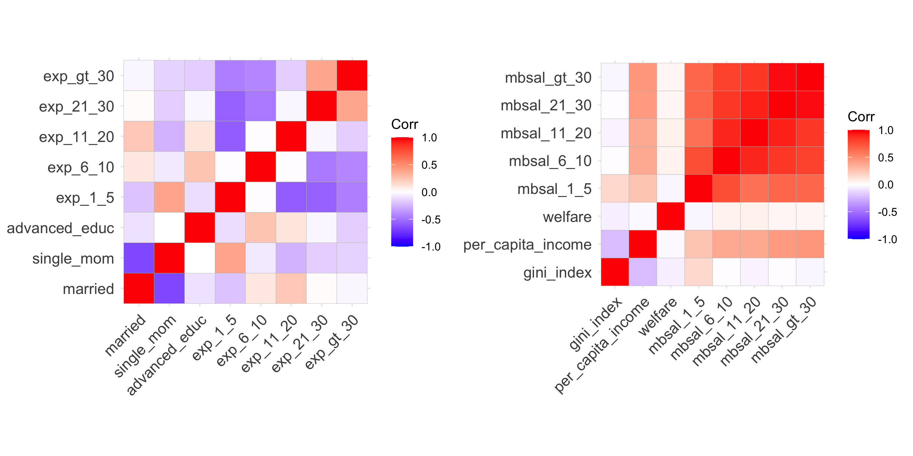
```

```{r total-correlation, out.width = "60%", fig.cap = "Distribution of explanatory variables.", fig.align='center', echo = FALSE}
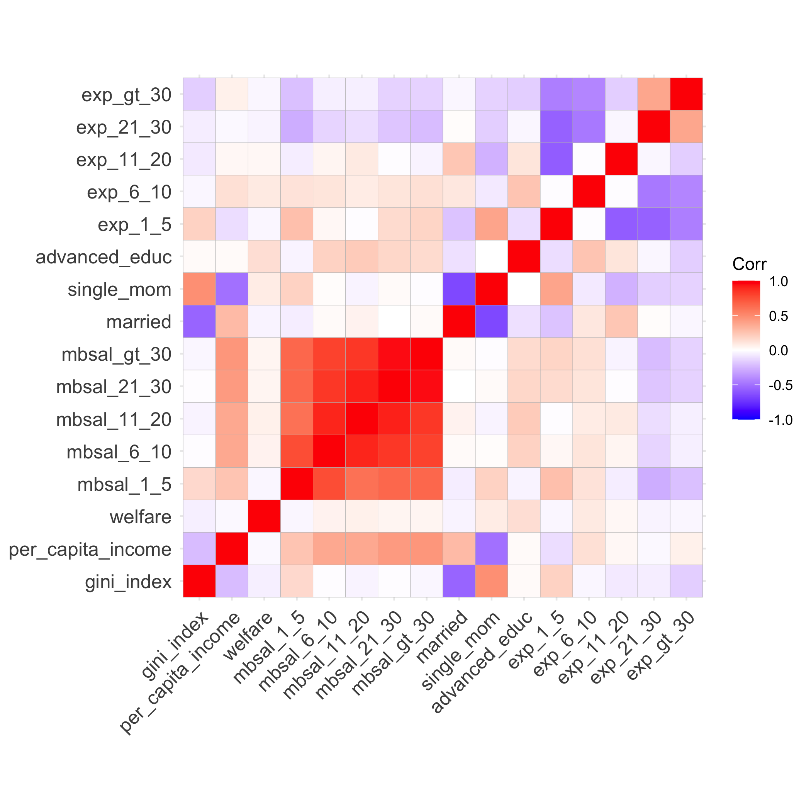
```

Plotting some explanatory variables (see Figure \@ref(fig:explanatory-variables)) with the response gives some indications to the following claims: counties with higher proportions of married couples, with better experienced teachers,  lower inequality, higher income, and less welfare needed tend to have less dropouts than those with higher single mothers, less experienced teachers, higher inequality, more welfare needed, and more unequal counties.

```{r explanatory-variables, out.width = "100%", fig.cap = "Initial findings with response and explanatory variables", fig.align='center', echo = FALSE}
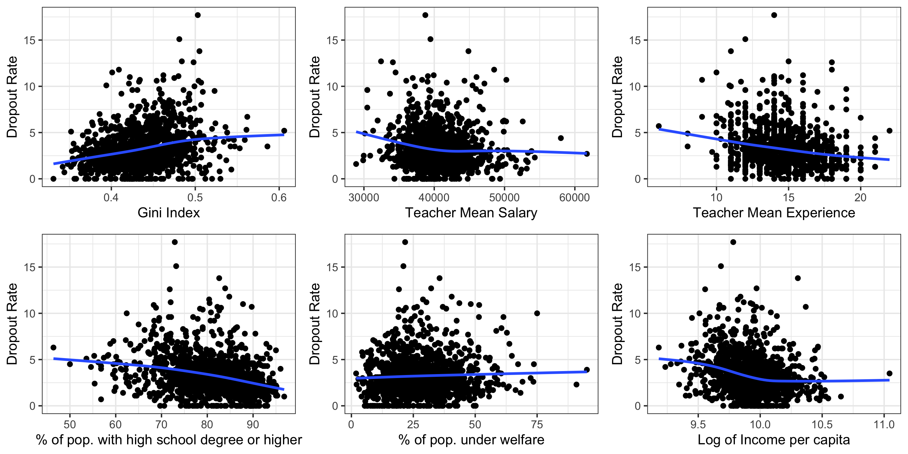
```

# Modeling

## Regression-based methods

### Ordinary least squares
The analysis for begins with an ordinary least squares regression of dropout rates on all 17 explanatory variables. 

The summary plot is shown in Table (\@ref(tab:ols-summary))). The multiple R-squared  is 0.247, indicating that these features explains 24.7% of the variation in the response.
```{r ols-summary, message = FALSE, echo = FALSE}
read_csv("../results/ols-summary.csv") %>%
  kable(format = "latex", row.names = NA, 
        booktabs = TRUE, digits = 4, 
        caption = "Ordinary least squares summary table on explanatory variables") %>%
  kable_styling(position = "center")
```

### Ridge Regression, LASSO Regression, and Elastic Net Regression
When fitting linear models with many features, they incur lots of variation and they tend to overfit the training data. Hence why other penalizations methods are performed to combat this and provide more insights to the feature variables that are most important.  

Figures \@ref(fig:ridge-trace), \@ref(fig:lasso-trace), and \@ref(fig:elnet-trace) shows the trace plots for ridge regression, LASSO regression, and elastic net regression respectively.

```{r ridge-trace, out.width = "50%", fig.cap = "Trace plot for ridge regression", fig.align='center', echo = FALSE}
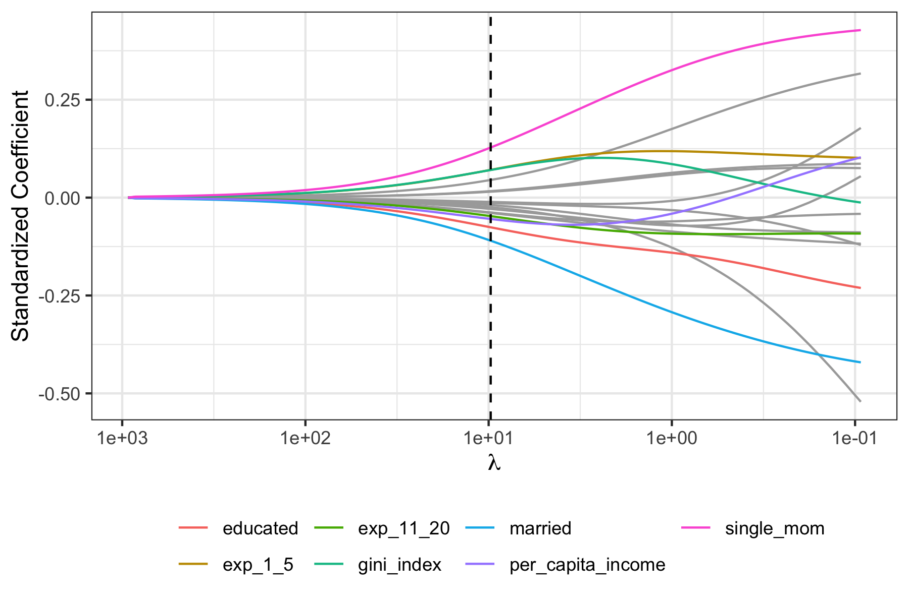
```
```{r lasso-trace, out.width = "50%", fig.cap = "Trace plot for lasso regression", fig.align='center', echo = FALSE}
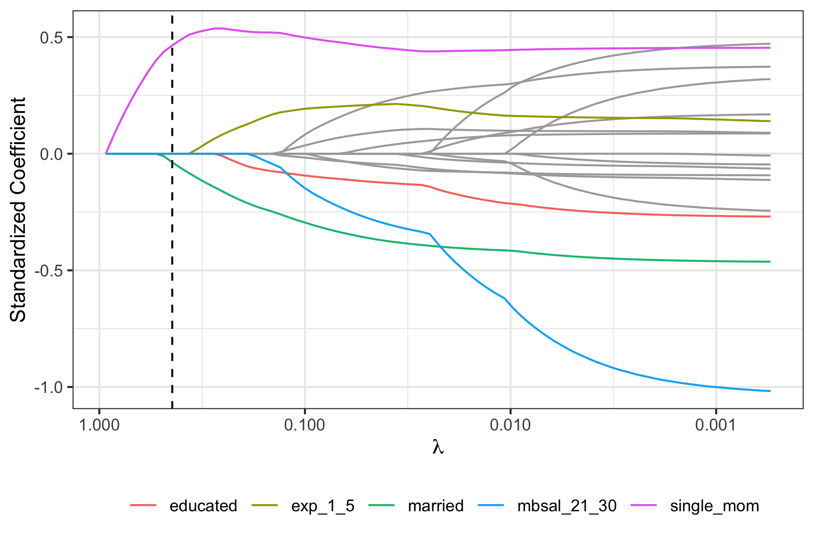
```
```{r elnet-trace, out.width = "50%", fig.cap = "Trace plot for elastic net regression", fig.align='center', echo = FALSE}
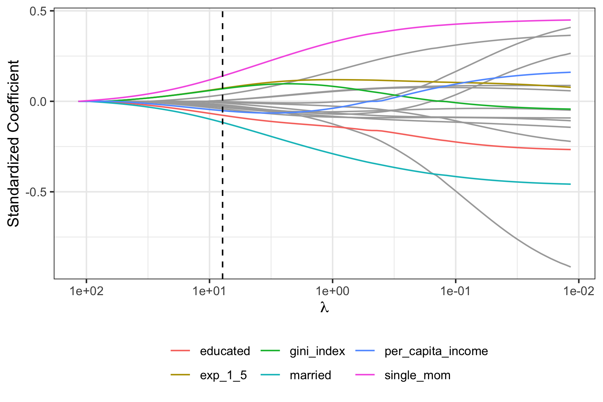
```

The variables selected by LASSO are shown in Table \@ref(tab:lasso-features). The top 5 featurs selected by elastic net regression are show in in Table \@ref(tab:elnet-features).
```{r lasso-features, message = FALSE, echo = FALSE}
read_tsv("../results/lasso-features-table.tsv") %>%
  kable(format = "latex", row.names = NA, 
        booktabs = TRUE, digits = 3, 
        caption = "Explanatory variables selected by LASSO regression") %>%
  kable_styling(position = "center")
```

```{r elnet-features, message = FALSE, echo = FALSE}
read_tsv("../results/elnet-features-table.tsv") %>%
  head(5) %>%
  kable(format = "latex", row.names = NA, 
        booktabs = TRUE, digits = 3, 
        caption = "Explanatory variables selected by elastic net regression") %>%
  kable_styling(position = "center")
```

## Tree-based methods

### Random forest
For random forest, we first optimize the number of trees to consider. The out of bag error is shown below. As we can see, the error decreases and remains relatively constant after around 200 trees. See Figure \@ref(fig:rf-oob-error)

```{r rf-oob-error, out.width = "50%", fig.cap = "Out of bag error for number of feature tuning for random forest", fig.align='center', echo = FALSE}
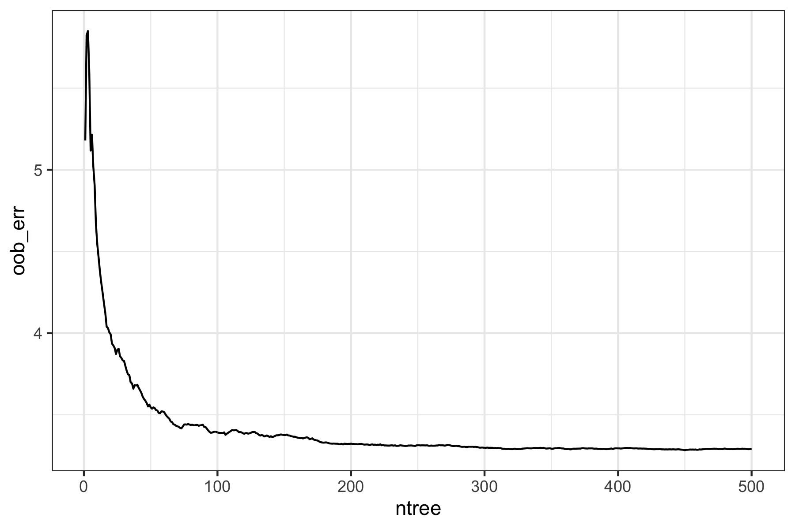
```

For random forest, we first optimize the number of features *m* to consider at each split by trainig the model on different values of *m*, ranging from 1 to 17. The out of bag error for each value of *m* can be observed in \@ref(fig:rf-m-oob-error). The out of bag error is minimized at a value of *m* = 5.

```{r rf-m-oob-error, out.width = "50%", fig.cap = "Out of bag error for number of feature tuning for random forest", fig.align='center', echo = FALSE}
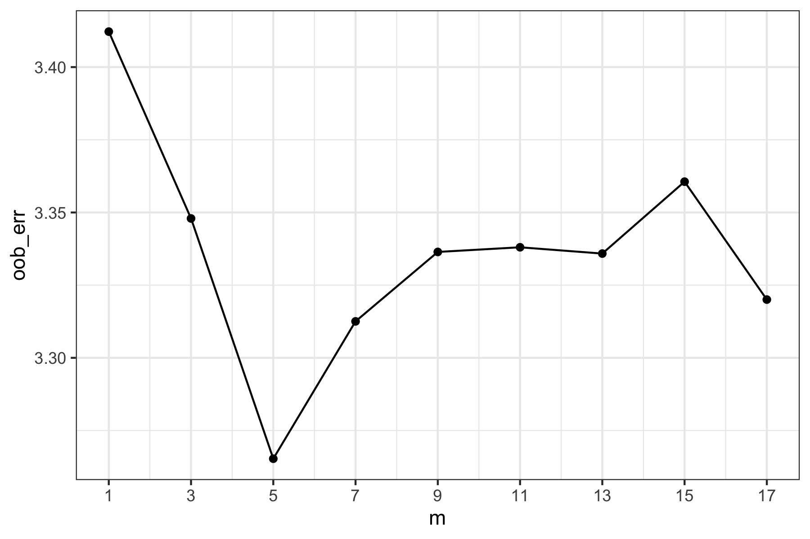
```

With this fitted model, we can take a look at the out of bag variable importance (how much prediction accuracy lowers with a given feature out of bag) and purity-based importance (how much node purity improves as a result from splitting that feature). Refer to Figure \@ref(fig:rf-variable-importance)

```{r rf-variable-importance, out.width = "100%", fig.cap = "variable importance and node purity of out of bag", fig.align='center', echo = FALSE}
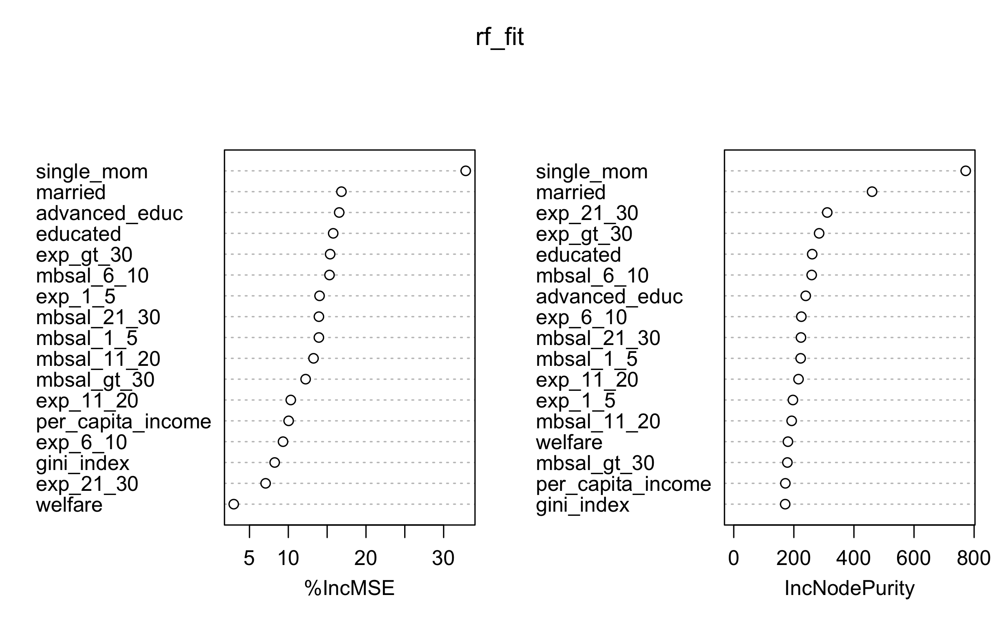
```

### Boosting

# Conclusions

## Method comparison


## Takeaways

TODO


## Data and Analysis Limitations

One major limitation is the need for more county-level data, such as adding in other factors that may contribute to dropout (i.e., juvenile crime rate, health-related factors, etc.), as well as a more careful analysis to highly correlated explanatory variables. Another limitation was the lack of data from more recent years on school dropouts, or even for teacher compensation for that matter. The latter proved to be the most limiting, as only two time periods between 2005-2007 were available. Although the County Health Rankings & Roadmaps has plethora of factors that could be added to this  analysis, their data only goes back to 2010, and it would bring bias to include this dataset here.

Another limitation is that the per capita income is over the past 12 months in 2009 inflation-adjusted dollars, while our teacher compensation dataset corresponds to 2006-2007.

## Follow-ups
 Although the models that were created in this study had a lower root-mean-squared error than the intercept model, it was still noticeably high and that may be due to lack of other important factors that may correlate with school dropouts. So, as mentioned above, it is highly recommended to take into consideration other county-level factors. Additionally, the teacher compensation study was taken place over two time-periods, so using both years may prove to be more insightful.
 
\bigskip

Citations:
https://nces.ed.gov/fastfacts/display.asp?id=16 
